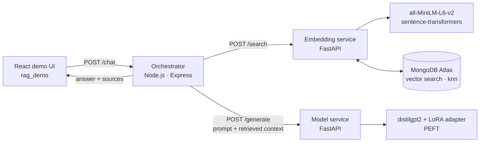

# 🧩 RAG + LoRA Microservices — Retrieval-Augmented Chat with a Fine-Tuned Adapter


> A small but **production-minded** RAG system split into independent services: a **sentence-transformer embedding + vector-search API**, a **LoRA-adapted language model API**, a **Node.js orchestrator**, and a **React chat UI** — all containerised.

The focus is **system design**: clean service boundaries, swappable components (SOLID interfaces), and the trade-offs of fine-tuning vs. retrieval.

---

## 🏗️ Architecture



**Request flow:** question → embed & retrieve top-k documents → build an augmented prompt (*context + question*) → generate with the LoRA-adapted model → return the answer **with its source passages**.

## 🧱 Services

| Service | Stack | Key endpoints | Responsibility |
|---|---|---|---|
| `embedding_service` | FastAPI, sentence-transformers, PyMongo | `/embed`, `/bulk_embed`, `/search`, `/delete_stale` | Embeds text, upserts vectors in batches, k-NN search, TTL-style housekeeping |
| `model_service` | FastAPI, Transformers, PEFT | `/health`, `/generate`, `/load_adapter` | Serves `distilgpt2` + LoRA adapter; **hot-swaps adapters** at runtime |
| `orchestrator_service` | Node.js, Express | `/chat`, `/health` | Retrieval → prompt building → generation; error handling per downstream call |
| `rag_demo` | React | — | Minimal chat UI that shows the answer and its sources |

`train_adapter.py` trains a **LoRA adapter** with PEFT on a small Q&A set (engineering + ML questions), CPU-friendly, and saves it for the model service to load.

## 🧠 Design Choices & Trade-offs

- **Abstract `Embedder` and `VectorStore` interfaces** → swap sentence-transformers for OpenAI embeddings, or MongoDB for FAISS/pgvector, without touching the API layer.
- **LoRA vs. full fine-tuning** – LoRA trains only a small fraction of the weights, uses little memory and adapters load in seconds; retrieval supplies fresh facts while the adapter shapes tone and domain vocabulary.
- **MongoDB Atlas vs. FAISS** – Atlas persists and scales horizontally; FAISS is faster in-memory but ephemeral.
- **Batch embedding** reduces round-trips and DB write overhead.
- **Latency** – `distilgpt2` keeps generation fast on CPU; a larger base model would improve answer quality at higher latency/cost.

## 🚀 Run Locally

**1 · Configure** — create `.env` files (never commit them):

```bash
# services/embedding_service/app/.env
MONGO_URI=mongodb+srv://<user>:<password>@<cluster>/   # your own Atlas URI
MONGO_DB=rag
MONGO_COLLECTION=documents
MODEL_NAME=sentence-transformers/all-MiniLM-L6-v2

# services/orchestrator_service/.env
PORT=3000
EMBEDDING_URL=http://localhost:8080
MODEL_URL=http://localhost:5000/generate
```

Create an Atlas **vector search index** on the `embedding` field.

**2 · Start the services**

```bash
# Embedding service
cd services/embedding_service/app
pip install -r ../requirments fastapi uvicorn sentence-transformers pymongo certifi pydantic-settings python-dotenv
uvicorn main:app --port 8080

# Model service (train an adapter first, or use the base model)
python train_adapter.py
cd ../../model_service && uvicorn app:app --port 5000

# Orchestrator
cd ../orchestrator_service && npm install && npm start

# UI
cd ../rag_demo && npm install && npm start
```

**3 · Try it**

```bash
curl -X POST http://localhost:8080/bulk_embed -H "Content-Type: application/json" \
  -d '{"docs":[{"id":"1","text":"FastAPI is great for ML services"},{"id":"2","text":"MongoDB supports vector search"}]}'

curl -X POST http://localhost:3000/chat -H "Content-Type: application/json" \
  -d '{"query":"Which database supports vector search?","k":2}'
```

A `docker-compose.yml` is included for running the stack in containers.

## 📁 Repository Structure

```
services/
├── embedding_service/app/   # FastAPI: embedders.py, vector_store.py, models.py, train_adapter.py
├── model_service/           # FastAPI: LoRA inference (app.py, inference_adapter.py)
├── orchestrator_service/    # Express: controllers/, services/ (embedding & model clients)
├── rag_demo/                # React UI
└── sample_doc.json          # Sample documents to ingest
docker-compose.yml
```

## 🔭 Roadmap

- Move all secrets to environment variables only; add `.env.example` files.
- Align Docker Compose build paths/ports and add a Dockerfile for the model service.
- Add retrieval evaluation (hit-rate / MRR) and response streaming.
- Replace `distilgpt2` with an instruction-tuned small model (e.g. Qwen / Llama 3.2 1B) + QLoRA.

---

## 👤 Author

**Anish Rane** — Data & AI Engineer · MSc Machine Learning & AI (LJMU) · Mechanical Engineer

[](https://anishrane-cox.github.io/Portfolio/)
[](https://www.linkedin.com/in/anish-rane/)
[](https://github.com/AnishRane-cox)

⭐ If you found this useful, consider starring the repo.
